# AWS Global Infrastructure


> [!TIP]
> To draw AWS architecture diagrams, you can use a  familiar tool tool:  **draw.io**.  When creating a new diagram, click on `+ More Shapes` and select `AWS` to add AWS icons.

<a id="readme-top"></a>

# Table of Contents

<details>
    <summary> Click to expend </summary>

- [Regions](#regions)
- [Availability Zones (AZ)](#availability-zones-az)
- [Edge Locations](#edge-locations)
- [VPC (Virtual Private Cloud)](#vpc-virtual-private-cloud)
- [IAM (Identity and Access Management)](#iam-identity-and-access-management)
    - [User and Group](#user-and-group)
    - [Policy](#policy)
    - [Role](#role)
    - [Practice creating a user inside a group with policy](#practice-creating-a-user-inside-a-group-with-policy)
- [Key Takeaways](#key-takeaways)
</details>


# Regions

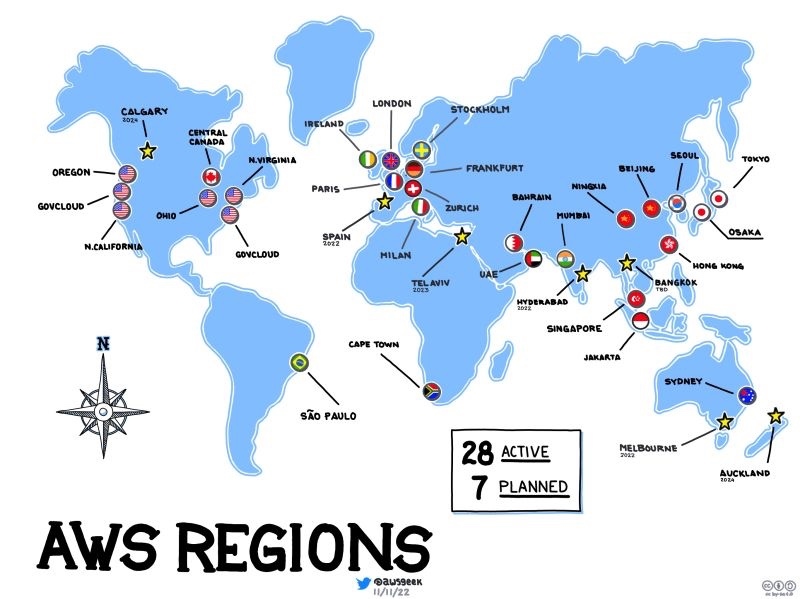

A Region is a **geographical** area where AWS has multiple data centers. Each region is located in a different country or area, often thousands of miles apart.

AWS currently has 30+ regions worldwide (e.g., us-east-1, eu-west-1, ap-southeast-1). Users must **manually** select a region — In most case, choosing one close to customers helps reduce latency.

**Some region code:**

- **Mumbai**: ap-south-1
- **Singapore**: ap-southeast-1
- **Sydney**: ap-southeast-2

Regions are connected by high-speed private links known as the **AWS Backbone.**

```plaintext
   +--------------------+               +----------------------+
   |    North America   |               |       Europe         |
   | - us-east-1 (VA)   |               | - eu-west-1 (IRE)    |
   | - us-west-2 (OR)   |               | - eu-central-1 (GER) |
   +--------------------+               +----------------------+
             |                                     |
             |      +----------------------+       |
             |------|    AWS Backbone      |-------|
             |      +----------------------+       |
             |                                     |
   +--------------------+               +--------------------+
   |        Asia        |               |      Australia     |
   | - ap-southeast-1   |               | - ap-southeast-2   |
   |   (Singapore)      |               |   (Sydney)         |
   +--------------------+               +--------------------+
```

<p align="right">(<a href="#readme-top">back to top</a>)</p>


# Availability Zones (AZ)

Each Region contains multiple Availability Zones (AZs), which are **physically** separate data centers (One AZ may consist of one or more data centers) and they are located 50–100 km apart to protect against disasters (fire, floods, etc.).

AWS **automatically** selects the AZ when deploying resources.


**Example**: `eu-wst-1` region (Ireland) has 3 AZs: `eu-west-1a`, `eu-west-1b`, `eu-west-1c`.

AZs are connected by **low-latency reliable fiber cables**.

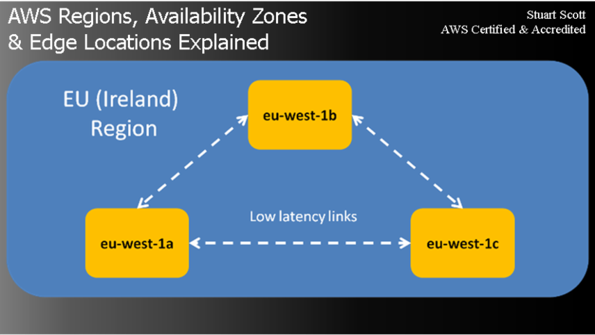


## Example Deployment

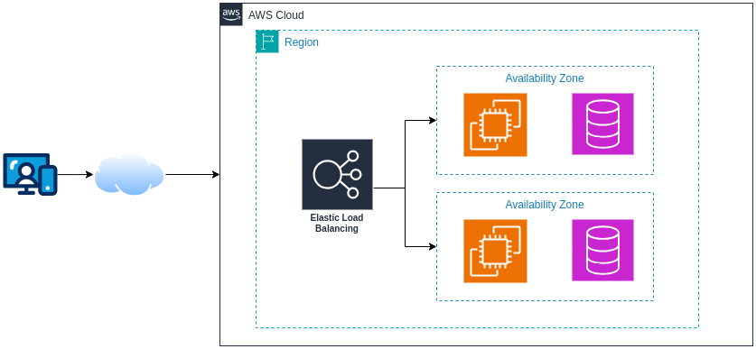

When deploying a website, we distribute servers across two or more AZs to ensure high availability.

In this setup, if one AZ goes down, the load balancer automatically redirects traffic to the other AZ, ensuring high availability.

<p align="right">(<a href="#readme-top">back to top</a>)</p>


# Edge Locations

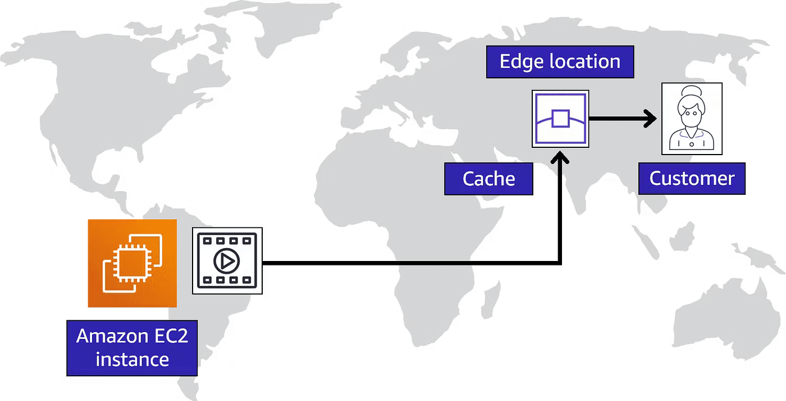

Since Regions cannot be spread to every coner of the world (due to cost and complexity), AWS provides Edge Locations — smaller data centers placed closer to users. These locations cache content from regional data centers to reduce response times. (Edge Locations are outside of AWS Regions.)

These Edge Locations are  part of **AWS CloudFront (CDN) content delivery network**.

<p align="right">(<a href="#readme-top">back to top</a>)</p>


# VPC (Virtual Private Cloud)

The AWS infrastructure described above are physical aspects, but user ypically interact with its logical aspects, they see AWS appears as a massive computing environment accessible to everyone. However, each user can create their own private space(s) in this computing environment, this private space is called **VPC** (An AWS account can have multiple VPCs). 


A VPC typically spans multiple **Availability Zones (AZs)** to ensure high availability. Resources within a VPC are isolated from other AWS users, providing security and control.

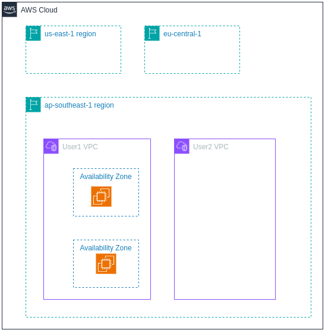

<p align="right">(<a href="#readme-top">back to top</a>)</p>


# IAM (Identity and Access Management)

Some basic concpets to learn:

- **IAM user**
- **Group**
- **Policy**
- **Role**

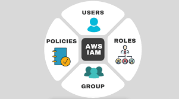


## User and Group

In reality, a VPC is rarely managed by a single person. It often involves multiple users, such as a team, a department, or an entire company.To control the access of multiple users to a VPC resources, AWS provides **IAM (Identity and Access Management)**, a framework for managing users and their permissions.

The highest-level administrator, called the **root user** (who created the AWS account and has full access to all resources), creates the VPC. The root user can then create multiple IAM users and assign them permissions, policies, and roles to access VPC resources securely.

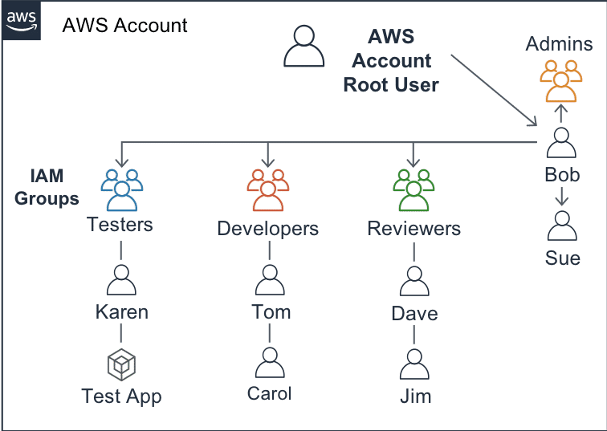

A **group** is just a collection of IAM users. Instead of assigning permissions to each user individually, you can assign permissions to a group, and all users in that group inherit those permissions. This makes it easier to manage permissions for multiple users.


## Policy

What an IAM user can do is controlled by **policies**. A policy is a document that defines permissions. Policies are categorized into two types:

| Policy Type         | Description                                            |
|---------------------|--------------------------------------------------------|
| Identity-based     | Attached to IAM users, groups, or roles. They define **who** can perform actions on **which** resources. |
| Resource-based     | Attached to specific AWS resources (e.g., S3 buckets, SQS queues). They define **that** resources can be accessed by **whom**.     |

*Identity-based policies can be thought of as **Capability Lists**, Resource-based policies can be referred to as **Access Control Lists (ACLs)**.*


**Real-world analogy:**

- Only IT staff can access the **Server Room**.
- The **Warehouse** can only be accessed by the warehouse manager and logistics officer.

## Role

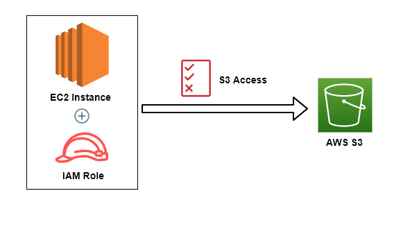


**Roles** allow you to grant **temporary** access to AWS resources. Instead of being directly assigned to users, roles are assumed when needed. Policies are still attached to roles, defining what actions can be performed. Once a user or service assumes a role, they gain the permissions defined in the attached policies for a limited period.

A useful analogy is using `sudo` in Linux to temporarily gain elevated privileges.

**Key Characteristics of IAM Roles:**

- Permissions are **temporary**.
- Users assume roles instead of being directly assigned policies.
- Useful for cross-account access and service-to-service interactions.

<p align="right">(<a href="#readme-top">back to top</a>)</p>


## Practice creating a user inside a group with policy

**Create a user**:

1. Search for **IAM** in the AWS search bar.
2. Go to **Users** \u2192 Click **Add user**.
3. Enter a **User Name**, tick **Provide user access to AWS Management Console**.
4. Select **I want to create an IAM user**.
5. Set a **custom password** or **auto-generate** one.
6. Click **Add user to group**. (Currently, no group exists, create one in the next step.)

**Create a group**:


1. Navigate to **User groups** → Click **Create group**.
2. Add the previously created user to this group.

At this point, the user has no permissions because no policies have been assigned to the group.

To verify this, open a new **incognito window** and log in with the newly created user credentials (Account ID of the root account, IAM username, and password). You will see that the user cannot perform any actions.

*(Find the Account ID by clicking on the root account username in the top right corner of the AWS webpage.)*

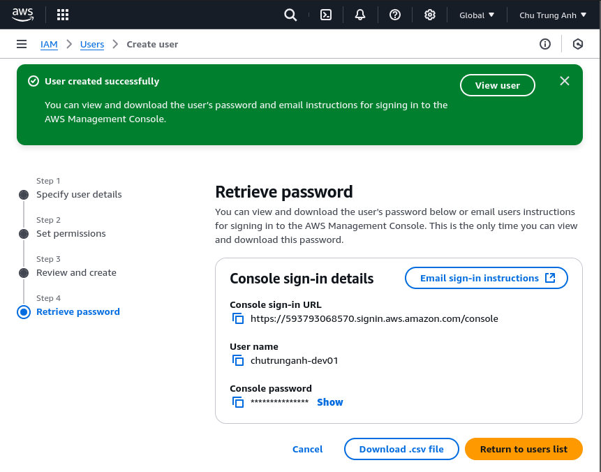

**Create a policy**:

To create a policy in **JSON format**, use the AWS Policy Generator: [AWS Policy Generator](https://awspolicygen.s3.amazonaws.com/policygen.html)

Example policy (this policy allows the user to perform all actions on all EC2 resources):

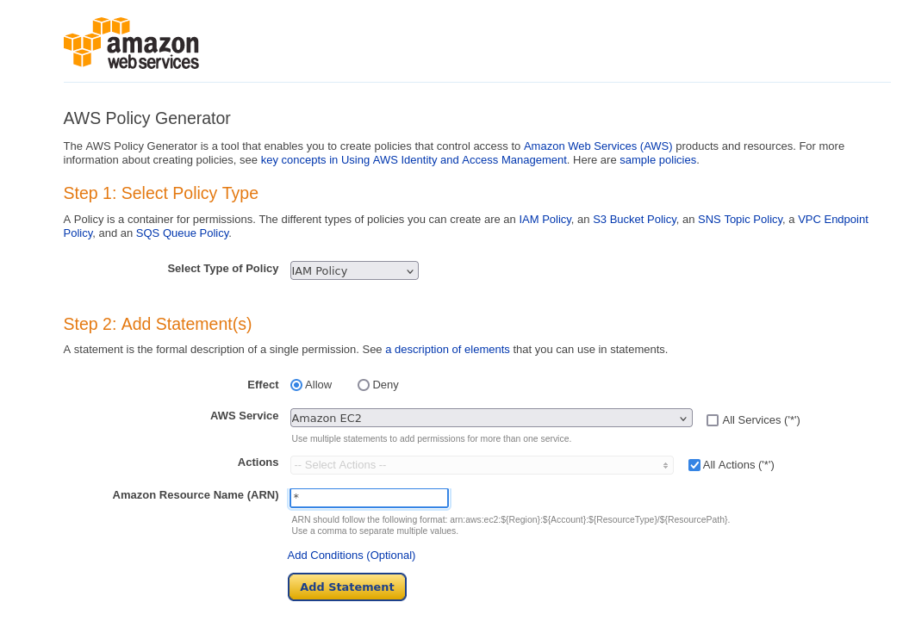

Click on generate policy will output the JSON like this

```JSON
{
  "Version": "2012-10-17",
  "Statement": [
    {
      "Sid": "Stmt1738571175089",
      "Action": "ec2:*",
      "Effect": "Allow",
      "Resource": "*"
    }
  ]
}
```

Then:

1. Go to the **Policies** tab.
2. Select **Create Policy**, Switch to **JSON format**.
3. Paste the policy JSON,  click **Create policy**.

**Assigning the Policy to a User Group**

1. Navigate to **User groups**.
2. Go to the **Permissions** tab.
3. Click **Add permission** → **Attach policies**.
4. Search for the newly created policy and attach it to the group.

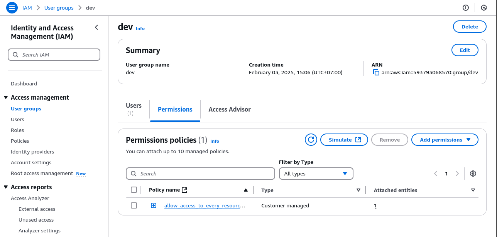


# Key Takeaways

- **Regions**: Geographical areas with multiple data centers.
- **Availability Zones (AZs)**: Physically separate data centers within a region.
- **Edge Locations**: Smaller data centers closer to users.
- **VPC (Virtual Private Cloud)**: A private space in the AWS cloud.
- **IAM (Identity and Access Management)**: Framework to manage users and their permissions.

<p align="right">(<a href="#readme-top">back to top</a>)</p>

