# Networking in VPC

In this section, we explore the essential networking components of a VPC, including VPCs, Subnets, Network Access Control Lists (NACLs), and Security Groups, along with practical exercises.

<a id="readme-top"></a>

## Table of content

<details>
<summary>Click to expand !!!</summary>

- [1. IGW (Internet Gateway)](#1-igw-internet-gateway)
- [2. Subnets](#2-subnets)
- [3. NACL (Network Access Control List)](#3-nacl-network-access-control-list)
- [4. Security Group](#4-security-group)
- [5. Practice: Creating subnets, set up Security Groupand lauch EC2, RDs instnaces](#5-practice-creating-subnets-set-up-security-group-and-lauch-ecs-rds-instances)

</details>

## Understanding VPC

Imagine a **VPC (Virtual Private Cloud)** as a private space for a user /team / organization inside the AWS cloud. Think of it like an apartment inside a public building—you have your own space while still being part of a larger environment. This concept will go along with us throught out this lesson.

Inside this VPC, we can create our own network, similar to setting up a LAN network at home (Hope you still remember your Computer Networks class 🙂 ).

*An AWS account can create multiple VPCs, providing isolated environments for different projects or teams.*

# 1. IGW (Internet Gateway)

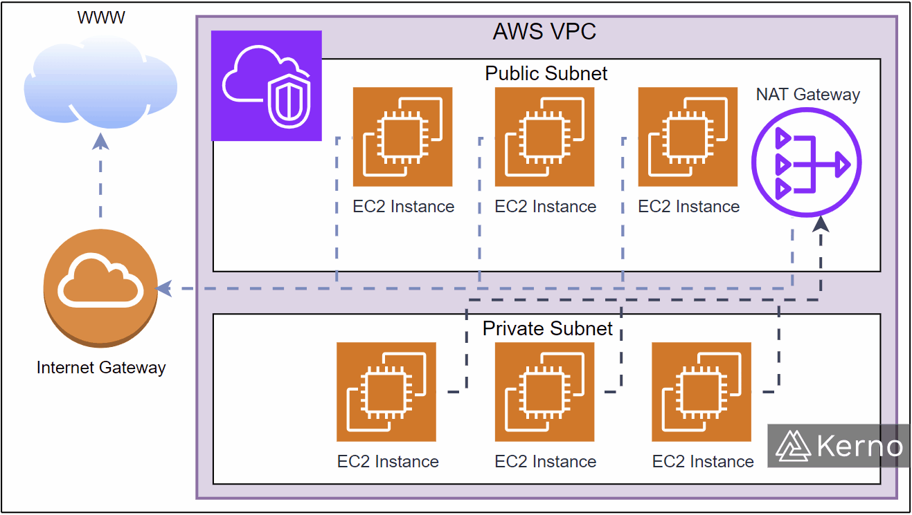

Some services inside the VPC need to access the internet. In AWS, all internet access must go through an **Internet Gateway (IGW)**. Think of IGW as the main entrance of an apartment building—it's the only way to reach the outside world.

# 2. Subnets

Similar to a LAN, a VPC allows us to create **subnets**. A subnet is a smaller network inside a VPC, each with its own route table (we will explore route tables later).

Think of subnets as rooms inside an apartment:

- Public rooms (e.g., living room) have access to the main door (Internet Gateway).

- Private rooms (e.g., bedroom) do not have direct access to the main door. So services inside them cannot be accessed from the internet. 

Similar concept applies in VPC:

- **Public subnets**: have a route to the Internet Gateway and thus allow services inside them to be accessible from the internet. Any service/server inside a public subnet will have a public IP address.


- **Private subnets**: do not have a route to the Internet Gateway and cannot directly accessed from the internet. (To  access the Internet, resources inside a private subnet will require a **NAT** device.)

***Technically, public or private subnets are just a matter of configuration. You can make a subnet public or private by setting up the route table accordingly.***

By default, every subnet you create is automatically associated with the main route table for the VPC. This main route table allows all traffic within the VPC, meaning initially, **they are all private subnets**. Later, you can change route rules or assign a different route table to align with the subnet's purpose.

More detail about Subnets can be found in this [AWS documentation](https://docs.aws.amazon.com/vpc/latest/userguide/configure-subnets.html)

**For examlpe**

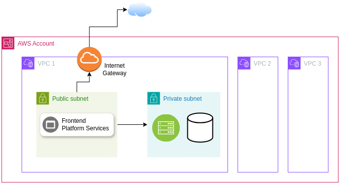

A frontend web server (which interacts with users) should be placed in a public subnet. A backend, database server or others critical services should be placed in a private subnet to ensure security.

# 3. NACL (Network Access Control List)

With each subnets, there is a NACL associated with it.  A NACL acts as a firewall controlling traffic in and out of the subnet.

Think of NACL as a door to a room:

- A living room door may allow everyone to enter.

- A bedroom door may only allow family members to enter.

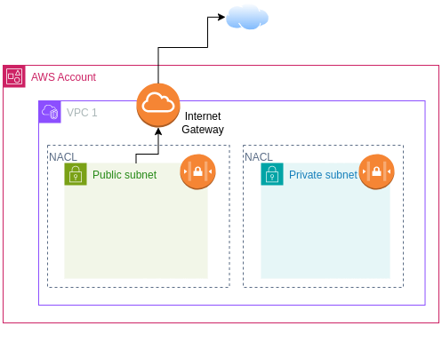

**Key Points about NACL**:

- **Stateless**: meaning that you must specify both inbound and outbound rules. For example, if you allow inbound traffic on port 80, you must also allow outbound traffic on port 80 to allow server responses.

- NACL is a collection of rules, envaluate in order, from the lowest number to the highest. For example a NACL inbound rules:

Rule #   | Type   | Protocol | Port Range | Source | Allow/Deny
---------|--------|----------|------------|--------|-----------
1        | All ICMP | ICMP | All | 0.0.0.0/0 | ALLOW
2        | HTTP | TCP | 80 | 0.0.0.0/0 | ALLOW
3        | HTTPS | TCP | 443 | 0.0.0.0/0 | ALLOW
4       | SSH | TCP | 22 | 0.0.0.0/0 | ALLOW
5       | All Traffic | All | All | 0.0.0.0/0 | DENY

*0.0.0.0/0 means any IP address is allowed.*

In this example, the NACL allows all ICMP traffic, HTTP traffic on port 80, HTTPS traffic on port 443, and SSH traffic on port 22. All other traffic is denied. If a packet matches rule 1, it is allowed, and no further rules are processed. If a packet does not match rule 1, it is checked against rule 2, and so on.


# 4. Security Group

While NACL acts as a firewall for the entire subnet, a Security Group serves as a firewall for individual services or servers (like EC2, S3) within that subnet. 

Think of NACL is a door to protect the bedroom, while each furniture inside the bedroom has its own lock for protection, representing the **Security Group**.

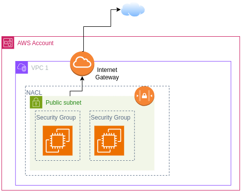

**Key Points about Security Groups:**

- **Stateful**: meaning that if you allow inbound traffic, the response traffic is automatically allowed. For example, if you allow inbound traffic on port 80, the response traffic on port 80 is automatically allowed without need defineding an outbound rule.
- **Only ALLOW rules**: If something is not explicitly allowed, it is denied.

**Example of a security group**

**Inbound rules:**

Security group rule ID | Port range | Protocol | Source | Security group ID
-----------------------|------------|----------|--------|-------------------
abcd1234 | 80 | TCP | 198.172.1.2/24 | sg-12345678
efgh5678 | 443 | TCP | 198.172.1.2/24 | sg-12345678
ijkl9012 | 22 | TCP | 198.172.1.2.24 | sg-12345678


**Outbound rules:**

Security group rule ID | Port range | Protocol | Destination | Security group ID
-----------------------|------------|----------|-------------|-------------------
mnop3456 | All | All | 0.0.0.0/0 | sg-12345678


According to this rule, all inbound and outbound traffic on ports 80, 443, and 22 from the IP address range 192.168.1.2/24 is allowed, while all other inbound traffic is denied, all 
outbound traffic is allowed.

<p align="right">(<a href="#readme-top">back to top</a>)</p>


# 5. Practice: Creating subnets, set up Security Group and lauch ECs, RDS instances

To practice, we try to set up a simple architecture as shown in this diagram:

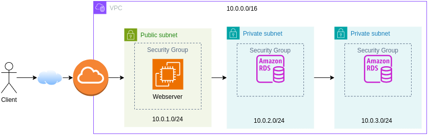

A VPC with three subnets: one public (to deploy an EC2 instance running Apache Webserver) and two private (to deploy RDS instance for database). Each service has a SecurityGroup to protect it. 

*Even though we only deploy a single RDS instance, we still need to create two private subnets for that sinlge instance because of AWS Multi-AZ deployments. When using Amazon RDS with high availability, AWS automatically provisions a primary database in one private subnet and a standby replica in another private subnet, located in a different Availability Zone (AZ). This setup ensures automatic failover in case of hardware failure, network disruptions, or maintenance, minimizing downtime.*

*In this practice, I does not use NACL since there is exactly only one service inside each subnets, so Security Group is enough*

> [!IMPORTANT]  
> To avoid over budget when you forget to turn off the services, you can set up a budget in AWS. Go to account in the top right coner → **Billing & Cost Management** → **Budgets** → **Create budget** → set up your budget. When you reach the budget, AWS will send you an email to notify you.


## Understanding CIDR Notation

First, let's understand **CIDR (Classless Inter-Domain Routing)**  notation, which is used in subnetting. Here’s a quick breakdown:

Our VPC network has address of `10.0.0.0/16`. The **/16** notation specifies that the first 16 bits are fixed for the network (each number is represented by 8 bits, so 16 bits is 10.0), and the remaining 16 bits can be used to assign IP addresses to hosts or create subnets (by adding more bits to the network address using a longer CIDR notation than /16).


For this setup, I used a **/24** CIDR block to create three subnets:

- Public subnet: `10.0.1.0/24`
- Private subnet 1: `10.0.2.0/24`
- Private subnet 2: `10.0.3.0/24`

For example, the public subnet 10.0.1.0/24 means the first 24 bit (aka 10.0.1 for the network ID), and the last 8 bits for host ID, allowing 256 IP addresses (2^8 = 256).

In other words, the network ID of the public subnet is 10.0.1.0 and all host belongs to this subnet will have IP address 10.0.1.`x`, where `x` is from 0 to 255, exclude some special value

- `10.0.1.0`: Network address itself
- `10.0.1.1`: Reserved by AWS for the VPC router
- `10.0.1.2`: Reserved by AWS for DNS
- `10.0.1.3`: Reserved by AWS for future use
- `10.0.1.255`: Normally, this is Broadcast address, but since AWS does not support broadcast in VPC, this IP is also reserved

For more detail, refer to the: [AWS Subnet CIDR blocks documentations](https://docs.aws.amazon.com/vpc/latest/userguide/subnet-sizing.html)


## Steps to Create VPC, Subnets and Security Groups

**Create a VPC**


1. Search for **VPC** in Dashboard → Click **Create VPC**.

2. Select **VPC only** and name your VPC

3. Set **IPv4 CIDR block**: `10.0.0.0/16`.

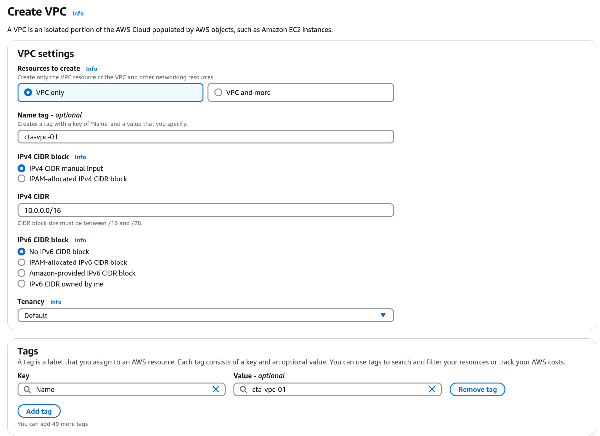

**Create an Internet Gateway**

1. Back to VPC Dashboard → Choose **Internet Gateways** on the left panel → **Create Internet Gateway**.

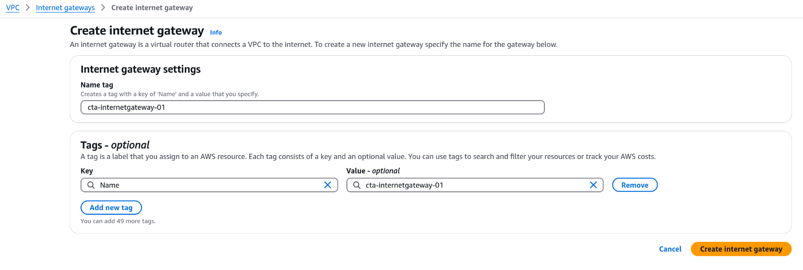

2. After creation, select **Actions** → **Attach to VPC** → Select the VPC you just created.

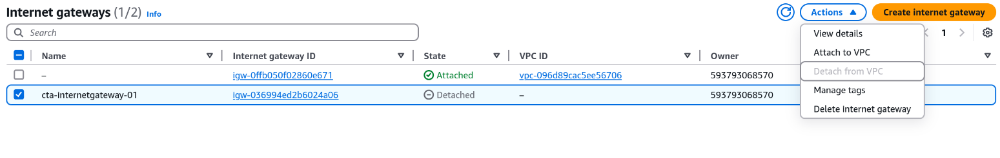

**Create Subnets**

1. Back to VPC Dashboard → Choose **Subnets** on the left panel → **Create Subnet**. We will create three subnets:


2. Choose the VPC you just created, enter the **IPv4 CIDR block** for the subnet as the diagram

- Public subnet: `10.0.1.0/24`

- Private Subnet 1: `10.0.2.0/24`

- Private Subnet 2: `10.0.3.0/24`

Example with the pulic subnet:

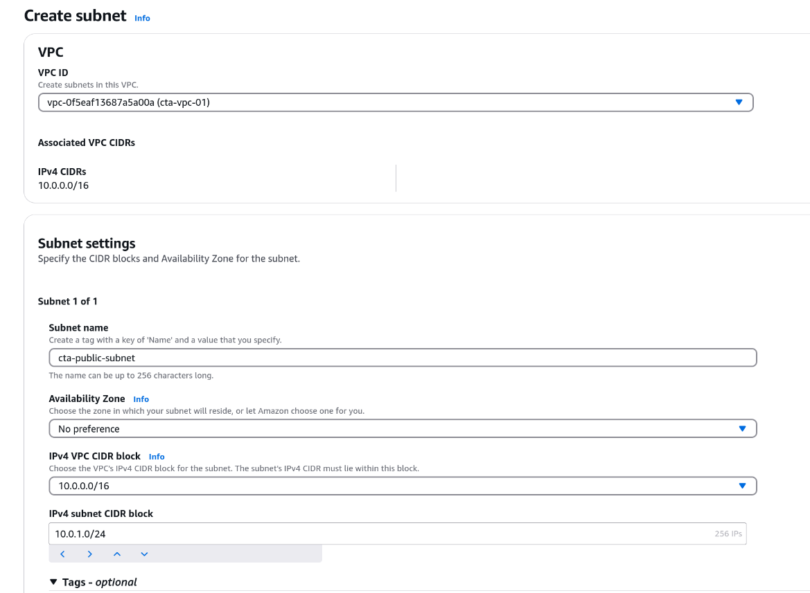

> [!NOTE] 
> Normally, you can let AWS automatically choose the Availability Zone (AZ) for your subnet. However, since we are setting up an RDS instance in the private subnet, you must **manually** choose the AZ for each private subnet. Each private subnet must be in a different AZ to ensure high availability. For example, if one AZ goes down, the other AZ will still be up and running.

If you let AWS auto-assign AZs, it might place all subnets in the same AZ, which can cause issues when deploying the RDS instance. For example, I encountered this error when deploying the RDS instance in two private subnets in the same  ap-southeast-1a AZ:

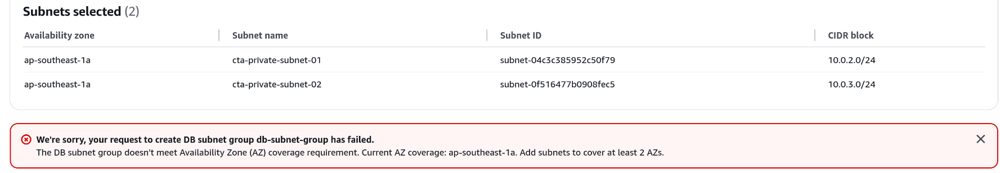

Now we have three subnets on two different AZs, but they are all still private since we haven't attach new route tables to them yet.

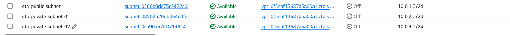

**Create Route Table**

1. Back to VPC Dashboard → Choose **Route Tables** on the left panel → **Create Route Table** → Name it, select your VPC

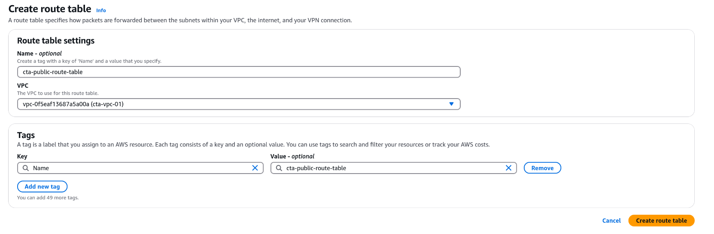


2. With public subnet: After creation → **Edit routes** → add Route to our internet gateway we created earlier. With private subnets, do not need to do anything more since it by default has route rule to internal VPC network.

- Route table for public subnet:

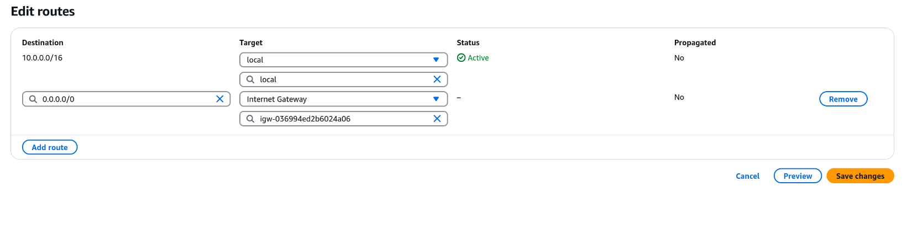

- Route table for private subnet:

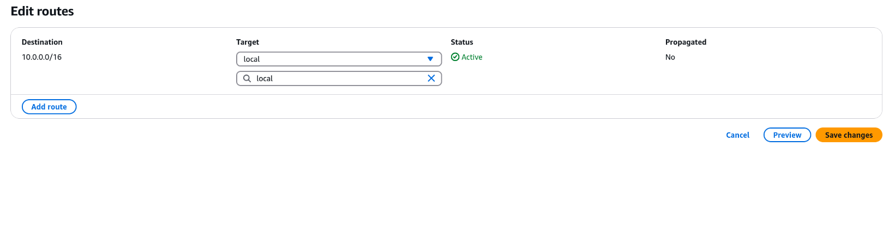


**Attach subnets to their corresponding route tables.**

1. Back to **Subnets** tab → Select a subnet → **Route table** tab → **Edit route table association** → Attach the appropriate route table.

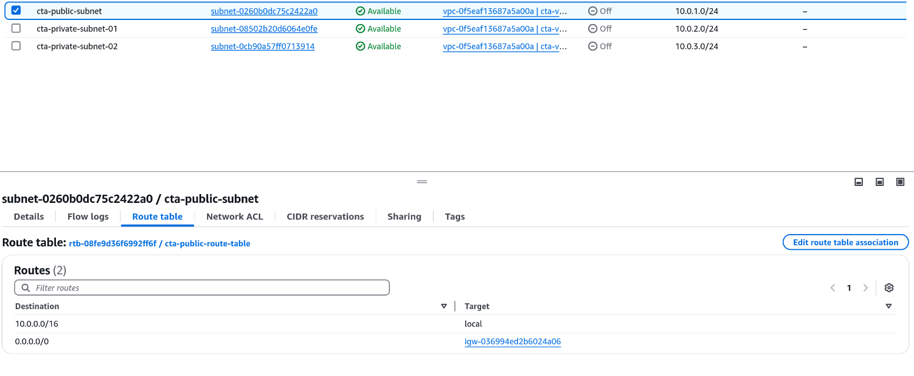

Also, with the  public subnet we need to enable auto-assign public IP address for the services inside this subnet to have public IP address. Go to **Action** → **Edit subnet setting** → check  **Enable auto-assing public IPv4 address**


Now, your **VPC**, **Subnets** and **Internet Gateway** are properly set up!

To check, click on your **VPC ID** → choose **Resource map** tab, you should see the following:

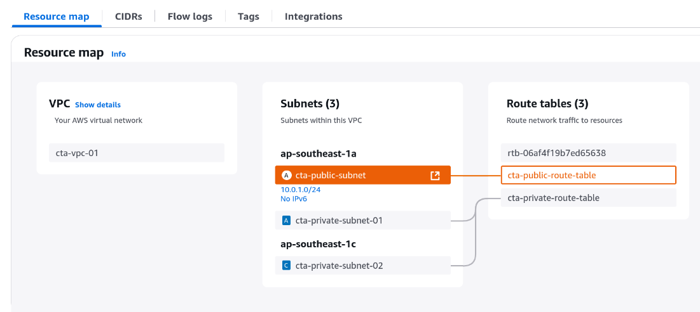


## Create Security Groups and lauch EC2 instances

Now we will create security group to protect the EC2 instances we are going to lauch

**Create Security Group**

1. Search for **Security Groups** → Create a new security group → Choose your created VPC, ddd inbound and outbound rules as needed. In this case, I allow communication on port **22** (SSH), **80** (HTTP), **443** (HTTPS) from any IP address.

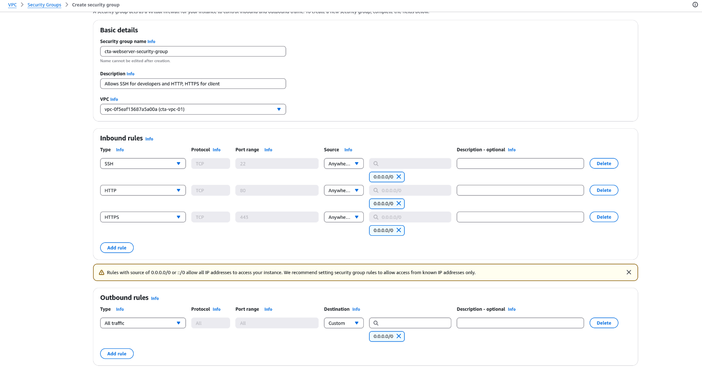

*Recall that Security Group is stateful, so if you allow inbound traffic on a port, the response traffic is automatically allowed.*

**Launch EC2 Instances**

We will learn more about AWS servies like EC2, S3, RDS, etc in the next lession . For now, let's practice creating EC2 instances. With AWS free tier for the first 12 months, you have 750 hours of EC2 instances. 

1. Search for **EC2** → **Lauch Instance**

2. Enter a name, choose **Amazon Machine Image (AMI)**, in my case, I choose Ubuntu.

3. Create a key pair, download it (`.pem` file) and store it in a safe place. This key pair is used to connect to the EC2 instance via SSH and can be reuse for other EC2 instances. (This is asymmetric encryption, AWS hold the public key, and the key you have just downloaded is the private key)

4. Configure the instance:

- **Network**: click on **Edit** (DO NOT use default AWS setting) → Choose VPC, public subnets we created earlier.

- **Security Group**: Choose **Select existing security group**  and select the one we created earlier.

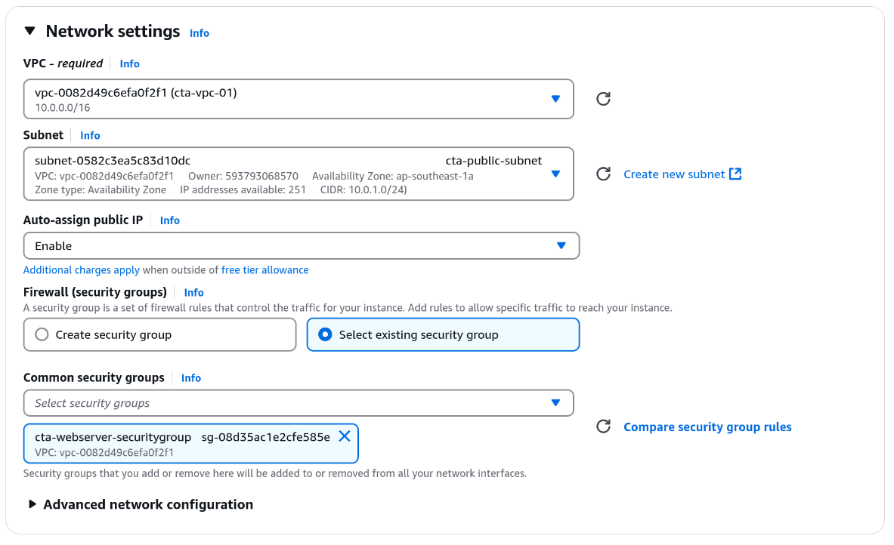

Wait unitll the instance is ready in few second  → Click on that instacne → Click on **Connect** on the top right, follow the instruction to connect to the instance via methods you like. Here I choose **SSH**.

Use the following commands to connect via SSH:

```bash
chmod 0400 PATH_TO_YOUR_KEY_PAIR.pem

ssh -i PATH_TO_YOUR_KEY_PAIR.pem ubuntu@PUBLIC_IP_ADDRESS_OF_YOUR_EC2_INSTANCE
```
- Replace `PATH_TO_YOUR_KEY_PAIR.pem` and `PUBLIC_IP_ADDRESS_OF_YOUR_EC2_INSTANCE` with your actual values. 

- Repalce the username `ubuntu` with the username of the AMI you choose. The default username for Ubuntu is **ubuntu**, for Amazon Linux is **ec2-user**, for CentOS is **centos**, for Debian is **admin**, for Fedora is **fedora** or **ec2-user**, etc. Comprehensive information about default AMI username can be found via [this link](https://docs.aws.amazon.com/AWSEC2/latest/UserGuide/managing-users.html). Change the user name accordingly in the command above.

To test if this EC2 instance can work properly, I install **Apache server** on this instance  with the command:

```bash
sudo apt update
sudo apt install apache2
```

Then go to browser and enter the public IP address of the EC2 instance, you should see the default page of Apache server.

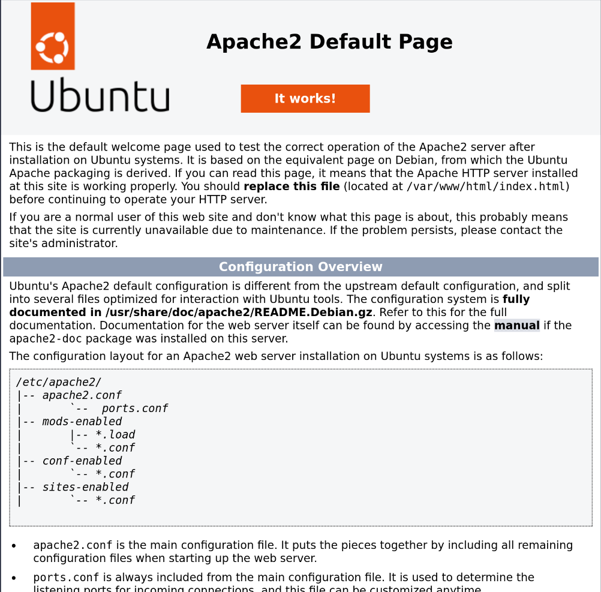

> [!WARNING] 
> Always remember to suspend or terminal your EC2 instances when you are done to avoid unnecessary charges

**Create RDS instance in private subnet**

1. Search for **RDS**. We will learn more about RDS in the next lession, for now, just simply understand that RDS is a managed database service by AWS.

2. Before, we create databse, we must first create database subnet group, which let AWS know which subnets to put the database server in. Click on **Subnet groups** → Create **DB subnet group** → Name it, choose the VPC → Choose the private subnet that we created earilier.

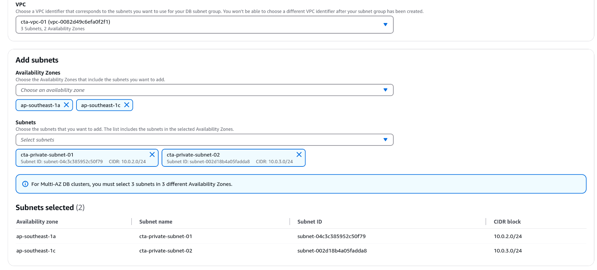

We selected two of the private subnets created earlier for the DB subnet group to use. Now, AWS servers running this RDS instance will be placed in both the `10.0.2.0/24` and `10.0.3.0/24` private subnets, which located in two different AZs.

*AWS won't let you create RDS instance if you do not have at least two subnets in two different AZ in the DB subnet group as I mentioned earlier when creating subnets*

3. Create Security Group to protect the RDS instance, only allow IP range from the EC2 instance (by choosing the security group of the EC2 instance as IP range) to connect to the RDS instance on port 3306 (MySQL)

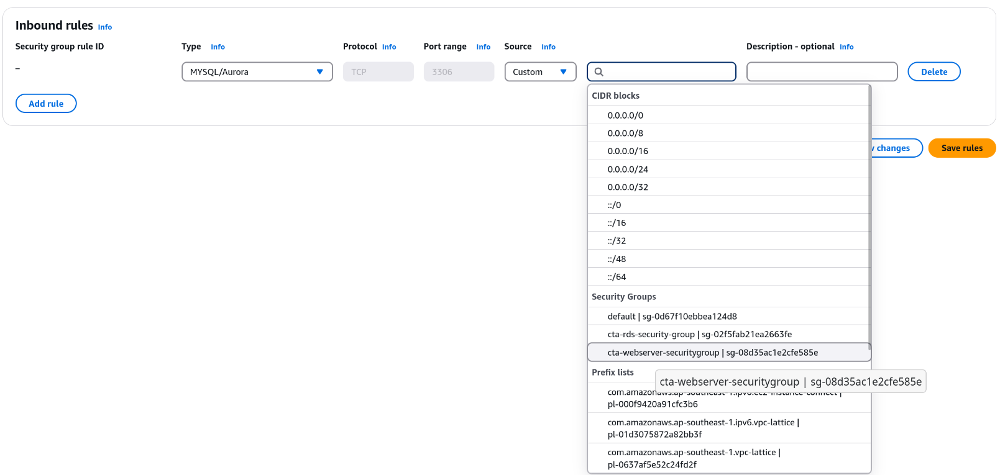

4. Create the database: Click on **Databases** → Choose the database engine you want, in this case, I choose **MySQL** → Choose the **free tier** → Choose our VPC, DB subnet group, and security group we created earlier → Enter the database server name, username, password, database name.


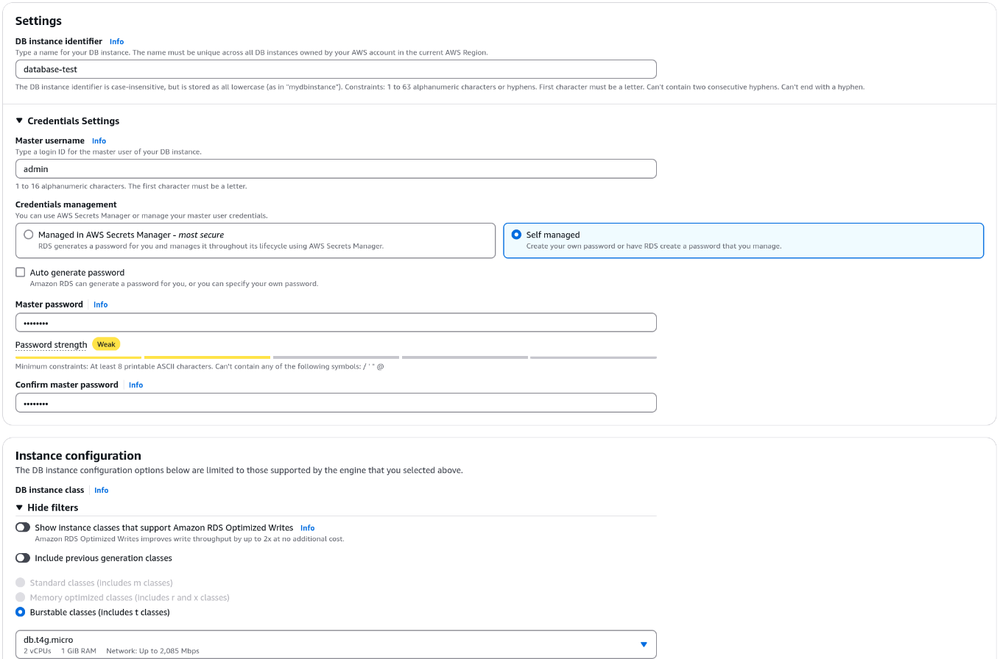
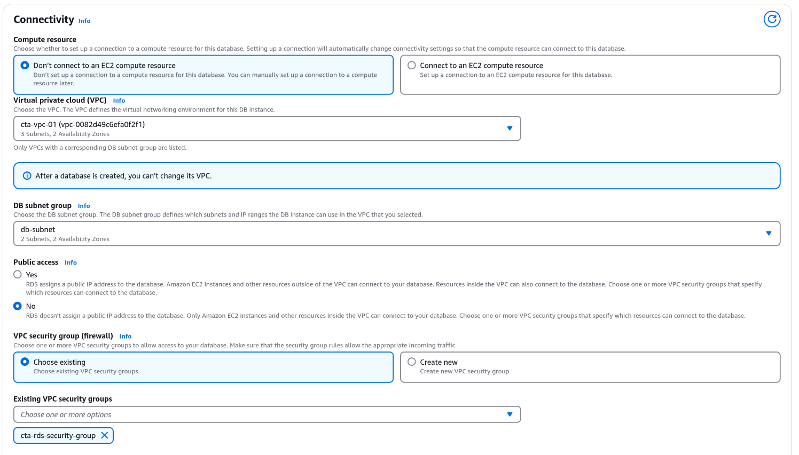


> [!IMPORTANT]  
> The name you enter in the **DB instance indentifer** box under the **Settings** section (As shown in above image) is the name of the database server, **NOT** the database name. The database name is entered in the **Initial database name** box under the **Additional configuration** section (As shown in below image). Use this name in the source code as crediential to connect to the database.


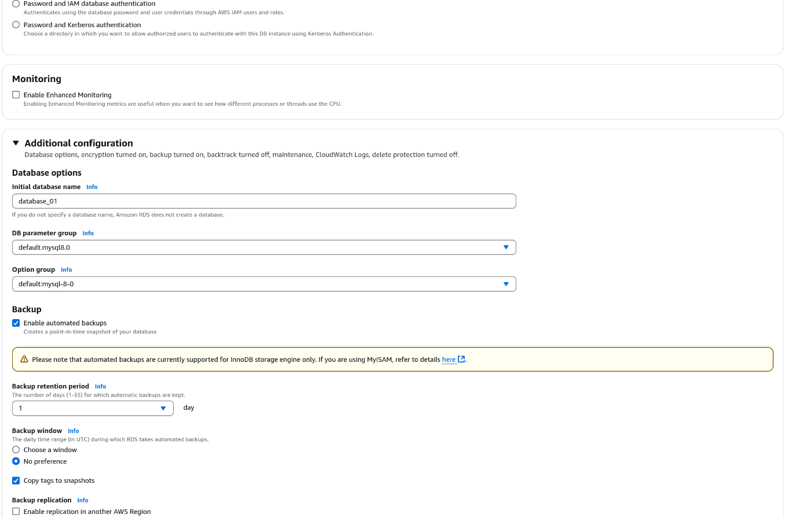

After all the setting, click on **Create database**. It will take a few minutes to create the database. After the database is created, click on **view Connection details**, copy the endpoint, username and password to connect to the database.


From the SSH connecting to the EC2 instance, I try this little pice of code to check if EC2 can reach the RDS instance, run these commands:

```bash
nano test.py # Create a new file in the text editor
```
Copy the folowing code to the text editor:

```python
import pymysql

# Database configuration
DB_HOST = "your-rds-endpoint.amazonaws.com"  # Replace with your RDS endpoint
DB_USER = "your-username"  # Replace with your DB username
DB_PASSWORD = "your-password"  # Replace with your DB password
DB_NAME = "your-database"  # Replace with your database name

try:
    # Connect to the database
    connection = pymysql.connect(
        host=DB_HOST,
        user=DB_USER,
        password=DB_PASSWORD,
        database=DB_NAME
    )
    print("Connection successful!")
    connection.close()
except Exception as e:
    print(f"Connection failed: {e}")
```

Replace the `your-rds-endpoint.amazonaws.com`, `your-username`, `your-password`, `your-database` with the actual values you copied from the RDS instance. Press `Ctr + o` to save, `Ctr + x` to exit, then run the following command to run the code:

```bash
sudo apt instll python3-pip
sudo apt install python3-venv
python3 -m venv venv            # Create a virtual environment
source venv/bin/activate        # Activate the virtual environment
pip install pymysql
python3 test.py
```
The expected output is `Connection successful!`. If you see this message, it means the EC2 instance can connect to the RDS instance successfully.

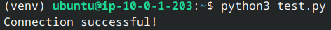

**Finnaly, remember to stop or terminal the EC2 and RDS instances on these subnets to avoid unnecessary charges. Do not delete the VPC, subnets, security groups, and route tables yet, as we will use them in the next lesson.**

<p align="right">(<a href="#readme-top">back to top</a>)</p>