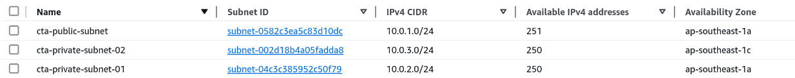
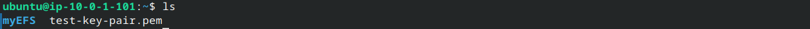

# Storage Services in AWS

Through the previous lessons, we have learned the basic structure of an AWS project. These structures are the foundation for launching services. AWS offers over 200 services, but this course will focus on the most common and useful ones. In this lesson, we will dive into AWS storage services, specifically **S3**, **EBS**, and **EFS**.

<a id="readme-top"></a>

## Table of Contents

<details>
<summary>Click to expand !!!</summary>

- [1. S3 (Simple Storage Service) 🪣](#1-s3-simple-storage-service-)
  - [How S3 stores data](#how-s3-stores-data)
  - [S3 Storage Classes](#s3-storage-classes)

- [2. EBS (Elastic Block Store) 📦](#2-ebs-elastic-block-store-)
  - [How EBS stores data](#how-ebs-stores-data)
  - [EBS Volume Types](#ebs-volume-types)

- [3. EFS (Elastic File System) 📂](#3-efs-elastic-file-system-)
  - [How EFS stores data](#how-efs-stores-data)

- [4. Summary](#4-summary)

- [5. Practice: Createing S3, EBS, and EFS Instances](#5-practice-createing-s3-ebs-and-efs-instances)
  - [5.1 Create S3](#51-create-s3)
  - [5.2 Create EBS](#52-create-ebs)
  - [5.3 Create EFS](#53-create-efs)

</details>

<br>

# 1. S3 (Simple Storage Service) 🪣


Amazon S3 (Simple Storage Service) is a scalable object storage service that allows you to store data in the form of objects. These objects can include text files, images, videos, and other types of **unstructured** data. with a maximum size of 5TB per object. There is no limit to the number of objects you can store as long as you can pay 💵 for it. 

## How S3 stores data

Inside a S3 instance, we create many buckets 🪣 to store objects. A bucket is a container for storing objects in S3. Think of it as a top-level folder or directory in the cloud. You can create folders within a bucket for better visual organization. However, that is just for "visual" organization, as S3 is a flat storage system and does not have a tree hierarchical structure like a traditional file system. Therefore, to access an object in S3, you need the object's unique URL, not a file path.


## S3 Storage Classes

S3 offers multiple storage classes, each designed for different use cases based on cost, accessibility, and performance. The storage classes are ordered from most expensive to cheapest as follows:


| **S3 Storage Class**        | **Description**                                                                                                                                      | **Use Case**                              | **Fees**                              | **Real-World Example**                                                                                                                                                                                   |
|-----------------------------|------------------------------------------------------------------------------------------------------------------------------------------------------|-------------------------------------------|---------------------------------------|---------------------------------------------------------------------------------------------------------------------------------------------------------------------------------------------------------|
| **S3 Standard**              | Highly available, durable, and low-latency, but it is the most expensive storage class.                | Frequently accessed data                 | Based on the total amount of data stored | **E-commerce website**: Product images, customer data, and order details since they are frequently accessed and need fast retrieval for a quick website load.                  |
| **S3 Intelligent-Tiering**   | Automatically moves objects between two access tiers based on access patterns. For example, if the file has not been accessed for a long time, it will be moves to S3 Glacier. When the file is accessed again, move from S3 Glacier to S3 Standard. | Unpredictable access patterns             | Monitoring usage frequency + moving objects between tiers | **IoT data**: Sensor data in a smart city, where some data is frequently accessed in real-time system, while other data can be archived after initial use. Intelligent-Tiering automatically optimizes storage based on access frequency. |
| **S3 Standard-IA (Infrequent Access)** | Lower storage cost than Standard, but with higher retrieval costs for data.                                | Infrequently accessed data, still need quickly access  | Retrieval fee                        | **Backup data**: Enterprise backup files that are rarely accessed but need to be restored quickly to continue company normal operations                                                                 |
| **S3 One Zone-IA**           | Same as Standard-IA but stores data in a single Availability Zone. Less durable but cheaper than Standard-IA.                                         |Infrequently accessed data, still need quickly acces, lower durability       | Retrieval fee                        | **Secondary backup**: Non-critical backup files or test data which will not causing any problem if lost. |
| **S3 Glacier**               | Designed for data archiving with retrieval times from minutes to hours.                                            | Archival storage                          | Retrieval fee                        | **Healthcare data**: Patient records that are infrequently accessed but must be kept for regulatory purposes (e.g., electronic health records).                                                           |
| **S3 Glacier Deep Archive**  | Cheaper than Glacier but has longer retrieval times (hours to a day).                  | Long-term archival storage | Retrieval fee                        | **Legal archives**: Documents, case files, or contracts retained for compliance reasons (e.g., 7-10 years).                                                                                             |


**Some key features of S3:**

- **Global Uniqueness**: Every bucket name must be globally unique across all AWS accounts, not just within your own account. Think of it like domain names or email address — no two buckets can share the same name.

- **Objects Cannot Be Edited Online**: Once an object is uploaded to S3, it cannot be edited directly. You must download it, make changes, and then re-upload it.

- **Support versioning**: S3 supports versioning, which means that if you upload a new version of an object, the old version is still kept in the bucket. Same as Git, you can revert to any version of the object.

- **Data replication**: S3 automatically replicates data across multiple servers and data centers, ensuring high durability and availability. AWS guarantees 99.999999999% (11 nines) durability and 99.99% availability.

<p align="right">(<a href="#readme-top">back to top</a>)</p>

# 2. EBS (Elastic Block Store) 📦

The term "**Elastic**" in AWS refers to the ability of a service to scale up or down dynamically and automatically based on demand. Scaling can be done in two ways:


- **Vertical Scaling**: Increase the size of the instance (CPU, RAM, etc) to handle more load.

- **Horizontal Scaling**: Increase the number of instances to handle more load.

## How EBS stores data

While S3 is typically used for storing static data (e.g., images, videos, backups), EBS is designed for block storage tied to an EC2 instance. It is commonly used for storing operating systems, application files, and databases. EBS **organizes data in blocks**, similar to a physical external hard drive. Think of it as plugging a hard drive into your computer, but in the cloud, where the computer is an EC2 instance.

**An EBS can be attached to only one EC2 instance at a time**. However, you can detach it from one instance and attach it to another instance. EBS volumes are **persistent**, meaning that the data stored on an EBS volume remains even after the EC2 instance is terminated.


## EBS Volume Types

Similar to external disk, EBS offers two main types of volumes.

- SSD (Solid State Drive): High performance
- HDD (Hard Disk Drive): Low cost


<p align="right">(<a href="#readme-top">back to top</a>)</p>

# 3. EFS (Elastic File System) 📂

EFS is a fully managed, scalable file storage service that can be shared across multiple EC2 instances. It operates as a network file system (NFS) and can be mounted on multiple EC2 instances simultaneously. EFS organizes data in a hierarchical file structure, making it ideal for shared storage between multiple EC2 instances. Think of it like a NAS (Network Attached Storage) in the cloud.

## How EFS stores data

EFS orgnize data by file hierarchical structure.


# 4. Summary


- **S3** is mostly used to store static assets like images, videos, backups, and logs that need scalable and durable access over the internet.

- **EBS** is primarily used for high-performance, low-latency block storage attached to a single EC2 instance, such as OS disks and databases.

- **EFS** is mainly used for shared file storage across multiple EC2 instances, ideal for web applications, container storage, and big data processing.

Each service has its unique strengths, making them suitable for different use cases in the AWS ecosystem. 

The price and maximum storage capacity of each service:


<p align="right">(<a href="#readme-top">back to top</a>)</p>

# 5. Practice: Createing S3, EBS, and EFS Instances

AWS Free Tier account provides 5GB of S3 , 5GB of EFS and 30BG of EBS for free for the first 12 months


## 5.1 Create S3 

1. Search for **S3** → **Create bucket**. Give it a unique name and let the rest of the settings be default.

2. Create Folder (if you want) 


3. Upload an example file. Under the **Propertites** section, you can choose the storage class for the object.


But for now, the file you uploaded can not be accessed by the public yet. To make it public:

- Click on the **Permissions** tab → **Block public access (bucket settings)**  → **Edit** → Uncheck all the options → **Save changes**. 

- Next, set the policy for the bucket. Right below the Block public access section, click on the **Edit** of the **Bucket policy** section. Copy and paste the following policy:

```json
{
    "Version": "2012-10-17",
    "Statement": [
        {
            "Sid": "PublicReadGetObject",
            "Effect": "Allow",
            "Principal": "*",
            "Action": "s3:GetObject",
            "Resource": "arn:aws:s3:::YOUR_BUCKET_NAME/*"
        }
    ]
}
```

This policy allows anyone to read all the objects in the bucket. Replace `YOUR_BUCKET_NAME` with your bucket name. Save changes.

4. Copy the object URL, then open a new brower tab and paste it, you should see the the content of file you uploaded.

**Remember to delete the bucket after you finish the practice to avoid unnecessary charges**

## 5.2 Create EBS

Actually, we have already come across creating EBS volumes when launching an EC2 instance. Try to lauch an EC2 instance, scroll down to the **Configuation storage**, we can set up the EBS volume for the instance


The first volume is the root volume, which is the operating system volume, so it can not be choose the volumn type as HDD. Click on **Add new volume** to add a new volume, you can choose the volume type as HDD.


## 5.3 Create EFS

What we are going to do ?


Recall in previous lession, we created security group, a VPC `10.0.0.0/16` with a public subnet `10.0.1.0/24` and two private subnets `10.0.2.0/24` (let call this private subnet 1) and `10.0.3.0/24` (private subnet 2) in two different AZs. Check again these subnets detail:



Inside each subnet, I will lauch an EC2 instance then after that I will mout all these EC2 instances to a EFS instance.

### Create a new security group for the EFS instance


This security group allows traffic on port **2049** with IP source of public subnet `10.0.1.0/24` and two private subnets `10.0.2.0/24`, `10.0.3.0/24` we created before. (Remember to choose our VPC so that these subnets are available to choose).

*2049 is the default port for NFT (Network File System) protocol, which is a protocol to access files over a network. It allows remote hosts to mount a part of a file system as if it were a local drive.*


### Create the EFS instance

1. Search for **EFS** → **Create file system** → Choose our VPC → Create


2. One create, choose that EFS → Choose **Network** tab. EFS will automatically see how many AZs in the VPC and create a mount point for each AZ.


As mentioned, we have three subnets on two AZs. According to [this AWS document](https://docs.aws.amazon.com/efs/latest/ug/accessing-fs.html), a EFS allows only one mount point per AZ. Therefore, we have a total of two mount points—one for each AZ.

Looking at the IP addresses of the mount points:

- In AZ ap-southeast-1a, which has two subnets, EFS choose the private subnet 1 to create the mount point.

- In AZ ap-southeast-1b, which has only one subnet, EFS obviously creates the mount point for the private subnet 2.


3. Click on the **Manage** button in the right corner. With each mount point, attach the security group we created before.


4. Go back to the EFS instance dashboard and click the **Attach** button in the top-right corner → Select our VPC → check on option **mount via IP**. We will have two mount commands with corresponding AZs. The first mount comamnd can be used by devices inside the AZ ap-southeast-1a (which include public subnet `10.0.1.0/24` and private subnet 1 `10.0.2.0/24`), the second is for the AZ ap-southeast-1b (which private subnet 2)


Copy the command of each mount point and run it in the EC2 instance to mount the EFS to the instance.

### Lauch EC2 instances

**Lauch EC2 instance in the public subnet**

1. Search for EC2 → **Launch instance** → Choose AMI as Ubuntu, Config the **Network** section to use our public subnet. In the Security group, check to make sure that it have inbuond rule to allow traffic on port 22 SSH on any IP address. 


2. One the instance is running, SSH to the instance (or via other way you prefer) 

```bash 
chmod 400 your_key_path.pem
ssh -i your_key_path.pem ubuntu@your_public_ip
```
3. Run `df -h` to see the current mount points.


Currently, there is no mount point to the EFS. Now we will try to mount the EFS to this instance. Run these commands to create a mount folder to the EFS

```bash
mkdir myEFS # Create a folder to mount the EFS, I names it myEFS
sudo mount -t nfs4 -o nfsvers=4.1,rsize=1048576,wsize=1048576,hard,timeo=600,retrans=2 fs-xxxxxx.efs.ap-southeast-1.amazonaws.com:/ myEFS 
# Command you copied from the EFS instance, remeber to change the folder name in command to the folder name you created
```
In case you meet error like this:


try

```bash
sudo apt install nfs-common
```
then run the mount command again. I only encounter this error when choosing the AMI as Ubuntu 24.04, but not when choosing the AMI as Amazon Linux.

4. After that, use `df -h` again and we should see a mount volume to the EFS.


The EFS volume has been mounted successfully. 

5. For testing, create a file `test.txt` inside the EFS folder and see if we can access it from the other EC2 instance.

```bash
cd myEFS   # Navigate to the EFS folder
sudo nano test.txt # Then type something to the file
```

`Ctrl + o` → Enter → `Ctrl + x` to save and exit

**Lauch EC2 instance in the private subnet 1**

1. Create another EC2 instance in the private subnet 1 `10.0.2.0/24`. However, since this is private subnet, it is a little bit tricky to SSH to it. We can not directly SSH to it. 

There are many ways to overcome this, but the most common way is to SSH to the public EC2 instance, then SSH to the private EC2 instance from there. This way is called **Host bastion**. It is the simpliest in our case since we already have a EC2 in public subnet.


Now we create a EC2 instance in the private subnet 1 same way we did with the public subnet, but this time **choose the AMI as Amazon Linux instead of Ubuntu**, download the new key pair or choose to reuse the key pair we used for the EC2 in the public subnet. The key pair is now on our loacl machine.

*Why did I choose Amazon Linux instead of Ubuntu? Because I encountered a `bad option` error when trying to mount the EFS to the Ubuntu instance as mentioned earlier. The fix is to run `sudo apt install nfs-common`, but since the EC2 instance is in a private subnet and cannot access the internet, I couldn't apply this fix. Therefore, I chose Amazon Linux, which does not encounter this issue.*

- For the key pair, from the local machine, copy the key pair to the EC2 instanc on public subnet via this command

```bash
scp -i your_key_pair_to_login_public_EC2_instance path_to_local_file_to_copy ubuntu@public_ip:path_to_remote_directory_to_save
```


From the SSH terminal to the public EC2 instance, check if the key pair is copied successfully



Successfully copied key pair to the public EC2 instance

- For the private IP address of the EC2 in the private subnet, go to the EC2 instance dashboard, click on that instance then you can see the private IP address of the instance.

Now from the public EC2 instance, SSH to the private EC2 instance

```bash
chmod 400 your_key_pair.pem
ssh -i your_key_pair.pem ec2-user@private_ip
```
*The default user for Amazon Linux is `ec2-user`, notice to change the user name*


2. After SSH to the private EC2 instance, run the mount command for the EFS mount point in the AZ ap-southeast-1a. Then go to the EFS folder and see if you can see the `test.txt` file created earlier by the public EC2 instance.


If you can see the `test.txt` file, then the EFS has been mounted successfully to the private EC2 instance.

For the last EC2 instance in the private subnet 2 in AZ ap-southeast-1b, you may need to create a new public subnet in that AZ then set up a EC2 instance in that subnet as a bastion host to SSH to the private EC2 instance. The process is the same as the previous steps. But will make this wrtting too long, so I will not cover it here, you can try it yourself.

For the last EC2 instance in the private subnet 2 `10.0.3.0/24` in AZ ap-southeast-1b, you may need to create a new public subnet in that AZ and set up an EC2 instance in that subnet as a bastion host to SSH into the private EC2 instance. The process is the same as the previous steps. To keep this writing concise, I will not cover it here 😅


**Remember to terminate all the instances and delete the EFS instance after you finish the practice to avoid unnecessary charges**

<p align="right">(<a href="#readme-top">back to top</a>)</p>

