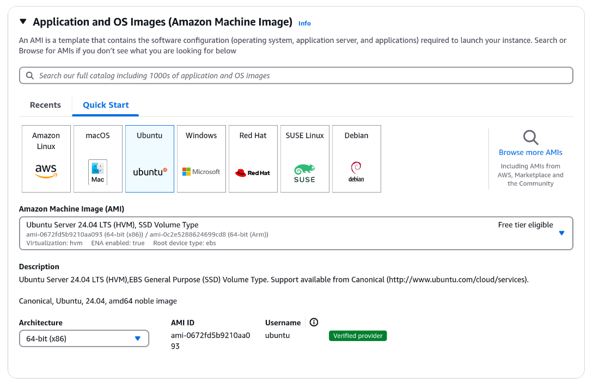
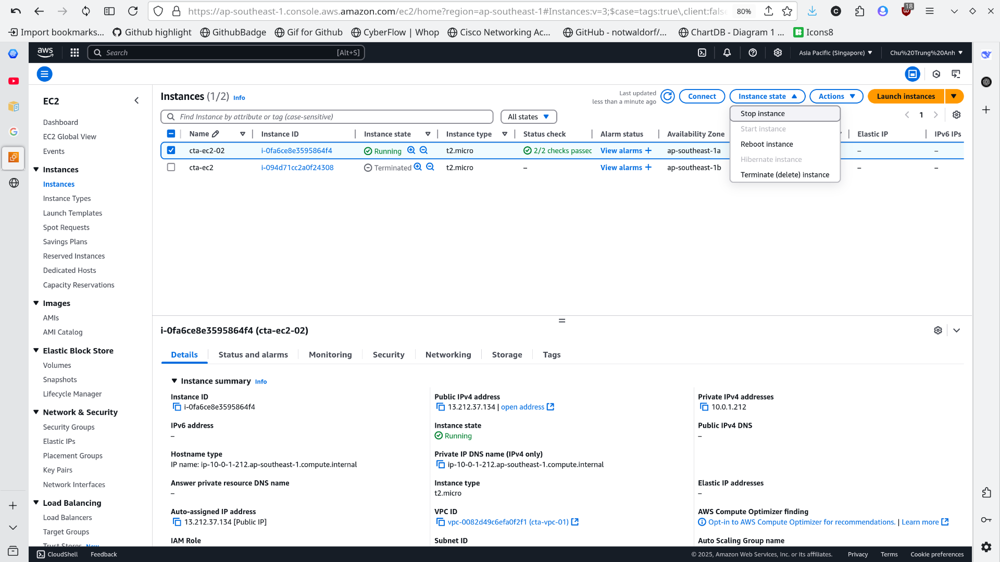

# AWS Compute Services

AWS Computer Services can be deviced into three main categories:


1. **Instances**: A virtual machine running on AWS physical servers. You have full control over the virtual machine, and it runs continuously. You pay for the time the instance is active. Example: AWS EC2.

2. **Serverless**: A service that runs code without requiring you to manage servers. You only pay for the execution time of your code (when it is triggered by an event), not when it is idle. Example: AWS Lambda.

3. **Container**: Package your code, dependencies, and configurations into a single object, and let AWS handle deployment and scaling. You pay for the time the container is running. Examples: AWS ECS, EKS, and Fargate.


# Table of Contents

<details>
<summary>Click to expand !!!</summary>

- [1. Instance (Virtual Machine)](#1-instance-virtual-machine)
  - [AMI (Amazon Machine Image)](#ami-amazon-machine-image)
  - [Instance Type](#instance-type)

- [2. Serverless](#2-serverless)

- [3. Container](#3-container)

- [4. Practice](#4-practice)
  - [4.1. Launch an EC2 instance](#41-launch-an-ec2-instance)
  - [4.2. AWS Lambda](#42-aws-lambda)

</details>

<br>

# 1. Instance (Virtual Machine)


In this section, we will focus on AWS EC2 (Elastic Compute Cloud), one of the most popular compute services. With EC2, you can configure: RAM, CPU, Storage, Network,Operating System (OS)...and more, same as on a physical device. You can choose the instance type that best fits your workload.

Some of EC2 we can configure is as folowing sections.

## AMI (Amazon Machine Image)

An **AMI** is a template that contains a software configuration, including the OS, application server, and applications. It serves as a blueprint for launching EC2 instances. You can choose from a variety of AMIs provided by AWS or the AWS community, or you can create your own.

For example, in a previous lesson, we selected an AMI for Ubuntu 24.04 LTS. This is the original AMI, which  only included the OS. After launching the instance, we installed additional software like MySQL, Apache, and PHP to turn it into a web server.

Instead of repeating this setup for multiple EC2 instances, you can create a custom AMI after configuring the first instance. This custom AMI can then be used to launch new instances with the same configuration.

## Instance Type

When creating an EC2 instance, after selecting an AMI, you choose the amount of RAM and CPU for the instance. However, you don't need to configure all the details. AWS has a list of pre-configured instance types, each optimized for different workloads. You can choose the instance type that best fits your workload.

These types are named using a specific name convention:


| Series | Description |
|----------------|-------------|
| C | Compute optimized |
| D | Dense storage |
| F | FPGA |
| G | Graphics intensive |
| Hpc | High performance computing |
| I | Storage optimized |
| Im | Storage optimized (1:4 vCPU to memory ratio) |
| Is | Storage optimized (1:6 vCPU to memory ratio) |
| Inf | AWS Inferentia |
| M | General purpose |
| Mac | macOS |
| P | GPU accelerated |
| R | Memory optimized |
| T | Burstable performance |
| Trn | AWS Trainium |
| U | High memory |
| VT | Video transcoding |v
| X | Memory intensive |
| Z | High memory |


| Option | Description |
|------------|-------------|
| a | AMD processors |
| g | AWS Graviton processors |
| i | Intel processors |
| b | Block storage optimization |
| d | Instance store volumes |
| e | Extra storage or memory |
| flex | Flex instance |
| n | Network and EBS optimized |
| q | Qualcomm inference accelerators |
| z | High CPU frequency |


After the period (`.`) is the instance size, such as `nano`, `tiny`, `small` or `4xlarge`, etc. Larger sizes offer more RAM and CPU resources.

Some examples:


In ASWS Free tier, you can only choose `t2.micro` instance type, which offer 1 vCPU and 1 GB of RAM.


  

# 2. Serverless

Serverless computing eliminates the need to manage server infrastructure. You simply write your code and upload it to AWS, AWS will take care of the rest. AWS runs the code when triggered by an event, and you only pay for the execution time—not idle time.


Characteristics of Serverless:


- **Hostless**: No server management required.
- **Elastic**: Automatically scales with demand.
- **Stateless**: Results from a process must be stored externally (e.g., in a database or S3). The system does not retain memory of previous executions.
- **Event-driven**: Code is triggered by events, not by a schedule or continuously running process, such as a file upload to S3 or a message sent to SNS.
- **Lego Blocks**: You can combine multiple serverless services to create complex applications.
- **Highly Available**: AWS manages the availability of the serverless service.
- **Usage-based Cost**: You pay only for the time your code is running, not for idle time.

**Example**: AWS Lambda is a popular serverless service. It’s ideal for short-running tasks (up to 15 minutes). For instance, when an image is uploaded to S3, a Lambda function can resize the image and save the resized version back to S3.

# 3. Container

An example of a container service is AWS ECS (Elastic Container Service).  

Learn later


# 4. Practice

## 4.1. Launch an EC2 instance

**Configurate and launch an EC2 instance**

1. Choose orginal AMI like `Ubuntu` 24.04 LTS



2. Choose instance type: `t2.micro`. You can also click on **Compare instance types** to see the details of each instance type.


3. Choose existing or create a new key pair. This key pair is used to connect to the EC2 instance. Save the key pair to your local machine.

4. Choose to create iunstance inside the public subnet we created in previous lessions so that the EC2 instance can connect to the internet.

Once you have configured your EC2 instance, click on Launch Instance to start the process. The instance will begin launching, and you will see its status in the EC2 dashboard.

After the instance is running, note its public IP address. You can use this IP address to connect to the instance. Here’s how to connect using SSH on Linux with this command:

```bash
chmod 400 your-key-pair.pem # change the permission of the key pair
ssh -i your-key-pair.pem ubuntu@your-public-ip
```

- Replace `ubuntu` with `ec2-user` if you’re using the Amazon Linux 2 AMI or other default user names of corresponding AMIs.

- Replace `your-key-pair.pem` with the path to the key pair file you downloaded.

- Replace y`our-public-ip` with the public IP address of your instance.

Once connected, you can install software and configure the instance as needed. For example, to install the Apache web server, run the following commands:

```bash
sudo apt update && sudo apt install apache2 -y
```

After installation, you can access the Apache web server by entering the instance’s public IP address in your web browser.

**Create a custom AMI**

Once your instance is configured, you can create a custom AMI to save this setup for future use. Here’s how:

1. **Stop the Instance**: Go to the EC2 dashboard → Select your instance → Click **Instance state** → **Stop instance**. Wait a few seconds for the instance to stop completely.



2. **Create the Custom AMI**: With the instance selected, click Actions → **Image and templates** → **Create image** → Fill in the required details (e.g., name, description) → Click **Create image**.


3. **Launch a New Instance Using the Custom AMI**:  When launching a new EC2 instance, go to AMI section → **My AMIs** → Select your custom AMI.


<br>

> [!IMPORTANT] 
> After practicing, remember to stop or terminate the EC2 instance and delete the custom AMI to avoid charges. (Storing custom AMIs will still be charged.)

<br>


## 4.2. AWS Lambda

Search for **Lambda** in the AWS console. Click on **Create function** → **Create from scratch**. Fill in the name, select **Runtime** (in this case i choose python 3.12) → In **Additional configuration**, tick **Enable function URL** to assign HTTP endpoint to the function → select **Auth type** is **NOne** for simplicity → tick on **Configuration cross-origin resource sharing (CORS)** so that the function can be called from any domain → Click on **Create function**.


Once the function is created, click **Deploy** to make it live.


Copy Function URL, then paste to the browser, you will see the result returned by the function.

