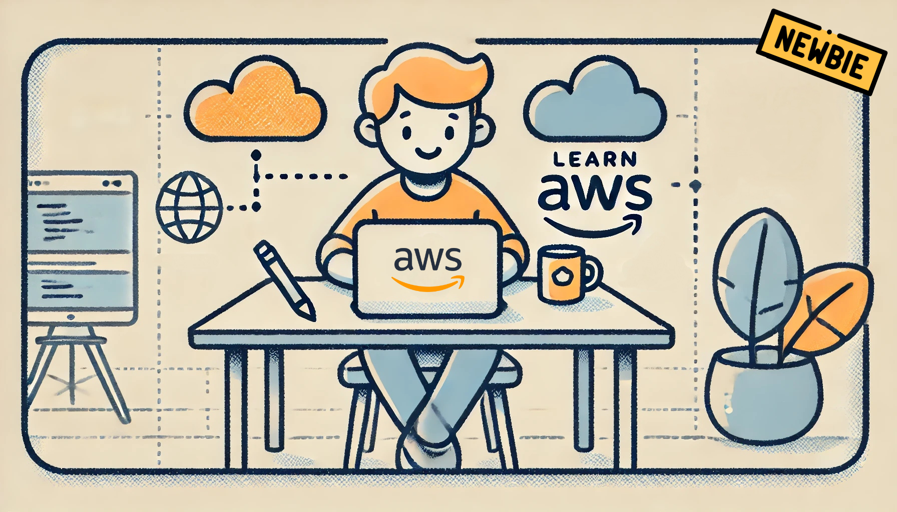

    <h1>🌟 AWS Learning Journey - Beginner's Guide 🌟</h1>

Welcome to my AWS Learning Journey repository! This is a personal collection of notes, hands-on exercises, and diagrams that I’ve created while learning AWS as a beginner. Whether you're just starting out or need a quick refresher, this repository is designed to help you understand basic AWS concepts in a simple and structured way.

This repo is my personal notebook for future reference, but I’ve shared it publicly so others can benefit from it too. Feel free to explore, learn, and contribute! 🚀

# 📖 Topics Covered

> [!TIP]
> For optimal readability, it's recommended to view the documentation in light mode.

Here’s a breakdown of the topics I’ve covered so far:

1. **AWS Global Infrastructure & IAM**

- Regions: Geographical areas with multiple data centers.

- Availability Zones (AZs): Isolated data centers within a region.

- Edge Locations: Points of presence for faster content delivery.

- IAM: Managing users, groups, policies, and roles.

[Read More](1.%20AWS_Global_Infrastructure,%20IAM.md)

2. **Networking in VPC**

- VPC: A private network within AWS.

- Subnets: Public and private divisions within a VPC.

- Internet Gateway (IGW): Connecting your VPC to the internet.

- NACLs & Security Groups: Controlling traffic at the subnet and instance levels.

[Read More](2.%20Networking_in_VPC.md)

**Still under construction... 🚧**

